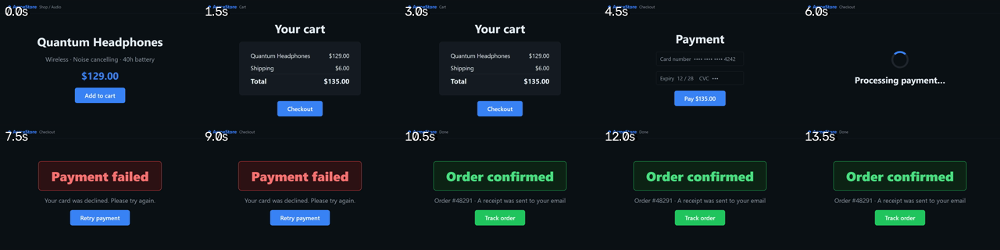

# vidqa

Local, deterministic video QA — for humans, CI gates, and AI agents.

Every command prints **one compact JSON object** (sorted keys, ≤4KB) and
exits **0** (pass) / **1** (gate failed) / **2** (error — a crash never
masquerades as a gate failure). Deterministic checks are byte-identical
run-to-run, so you can diff them and gate on them. Nothing is uploaded
anywhere: analysis is ffmpeg + OpenCV, and the optional semantic layer
talks to a local Ollama model.

Built for game/build QA — "is this capture smooth?", "did rendering
break vs the golden frame?", "what does this clip actually show?" — at
zero API cost, but nothing about it is game-specific.

## Demo

A checkout flow recorded by a test runner, analyzed by vidqa:



```sh
$ vidqa strip run.mp4 --out sheet.png --every 1.5   # the image above

$ vidqa when run.mp4 "Payment failed"               # when did the error show?
{"first_s":8.0,"found":true,"intervals":[{"end_s":10.5,"start_s":8.0}],"mode":"text","query":"Payment failed","sampled":31,"step_s":0.5}

$ vidqa shot run.mp4 --out evidence.png --at-text "Payment failed"
{"at_s":8.25,"found":true,"height":800,"out":"evidence.png","query":"Payment failed","width":1280}

$ vidqa ci run.mp4 --rules checkout.rules.json      # gate it in CI
{"pass":true,"rules":[{"detail":{"first_s":10.5},"pass":true,"rule":{"by_s":15,"text":"Order confirmed","type":"expect_text"}},{"detail":{},"pass":true,"rule":{"type":"no_blank_frames"}}],"step_s":0.5}
```

## Requirements

- Python 3.11+
- [ffmpeg/ffprobe](https://ffmpeg.org/) on `PATH` (installed separately;
  not bundled)
- Optional, for `ask`: [Ollama](https://ollama.com/) with a vision model
  (default `qwen3-vl:8b`)
- Optional, for `live` (Windows only): Intel PresentMon — a copy is
  bundled in `tools/`
- Optional, for `speech`: faster-whisper (`pip install vidqa-cli[speech]`;
  runs on CPU, model downloads on first use)

## Install

```sh
pip install vidqa-cli
```

(The PyPI name is `vidqa-cli`; the module and the command are both `vidqa`.)

From source, for development:

```sh
git clone https://github.com/DSmereski/vidqa
cd vidqa
python -m venv .venv
.venv/Scripts/pip install -e .[dev]   # Windows; use .venv/bin/pip elsewhere
```

## Commands

| Command | What it answers |
|---|---|
| `vidqa report <video> [--golden ref --at t]` | One-call verdict: probe + timing + scenes (+ audio, + golden diff). Start here. |
| `vidqa probe <video>` | Streams, resolution, duration, CFR/VFR. |
| `vidqa timing <video>` | Stutter, duplicate frames, freezes; frame-time p50/p95/p99. |
| `vidqa diff <cand> --golden ref [--at t] [--mask-out m.png] [--ignore x,y,w,h]` | Golden-frame gate: SSIM floor + 8×8-grid worst-cell error + pHash scene check; `--ignore` excludes dynamic regions (clock, fps counter). |
| `vidqa scenes <video>` | Scene-cut timestamps. |
| `vidqa audio <video>` | Silences, clipping, volume levels. |
| `vidqa speech <video> [--expect "phrase"] [--find "phrase"]` | Transcribe spoken audio (faster-whisper, local CPU); `--expect` gates on a substring, `--find` returns the timestamps where a phrase was spoken. |
| `vidqa ocr <video\|image> [--at t]` | Read on-screen text (RapidOCR, CPU, offline after first model download). |
| `vidqa find <video\|image> --template t.png [--at t]` | Locate a known UI element; exit 1 if absent. |
| `vidqa ask <video> "question" [--enum a,b,c] [--expect a]` | Local-VLM Q&A; `--expect` turns it into a gate. |
| `vidqa live <process.exe> [--seconds 10]` | Real frametimes of a *running* app via PresentMon ETW (Windows). |
| `vidqa when <video> "text" [--template el.png]` | *When* text or an element is visible: intervals in seconds; exit 1 if never. |
| `vidqa shot <video> --out f.png --at 12.5 \| --at-text "Error" \| --around 12.5 [--zoom] [--crop x,y,w,h] [--annotate x,y,w,h,label]` | Precise frame evidence, by timestamp or by visible text; `--around` writes a before/after pair, `--zoom` crops it to what actually changed; bake labeled boxes in. |
| `vidqa moments <video> [--text q]` | Auto-index a recording into chapter markers — freezes, stutter, cuts, blanks, silences, and where a text first/last appears — so nobody scrubs blind. |
| `vidqa contrast <video\|image> [--at t] [--min-ratio 4.5]` | Flag low-contrast on-screen text (WCAG-approx accessibility probe); exit 1 when anything falls below the floor. |
| `vidqa locate <video> "fail text" [--shots dir]` | Failure auto-locate: feed it the assertion/error text → last-good and first-bad timestamps + the exact frames. |
| `vidqa judge <video> --rubric rubric.json` | Visual smoke review: a UX checklist judged by the local VLM, one enum verdict per item; exit 1 if any fail. |
| `vidqa text <video> [--contains q]` | Everything the screen ever said: every text line with visibility intervals; short-lived toasts/snackbars flagged. |
| `vidqa redact <video> --out safe.mp4 --region x,y,w,h` | Black out regions (PII, tokens) — solid fill, not reversible blur — so a recording can be shared. |
| `vidqa strip <video> --out sheet.png [--every 1]` | Filmstrip contact sheet: the whole run as one timestamped thumbnail grid. |
| `vidqa clip <video> --out cut.mp4 --from 10 --to 14` | Small mp4/gif excerpt for bug tickets. |
| `vidqa ci <video> --rules rules.json [--md report.md]` | CI gate: an expectations file → one exit code; `--md` also writes a PR-comment-ready report. |
| `vidqa trace <trace.zip> [--video v --at-step "click" --out f.png]` | Playwright trace → step timeline; grab the frame where a step completed. |
| `vidqa record-android --while "cmd" --out rec.mp4` | Record the Android device screen (adb) while a test command runs; exits 1 if the command fails. |
| `vidqa load <video> [--content-by S] [--settled-by S]` | Perceived loading from video alone: time to first content + visual settle; deadlines gate. |
| `vidqa bugpack <video> --at T --out dir` | Ticket-ready evidence folder: frame, ±3s clip, event track, report JSON, summary.md with OCR. |
| `vidqa srt <video> --out events.srt` | Detected events (freezes, stutter, cuts, silences) as a subtitle track — any player shows the analysis on the scrubber. |
| `vidqa rundiff <a> <b> [--shots dir] [--ignore x,y,w,h] [--trace-a a.zip --trace-b b.zip] [--md report.md]` | Where two runs of the same test diverge: by clock, or aligned by Playwright steps when traces are given; exit 1 on divergence. |

Example:

```sh
$ vidqa timing capture.mp4
{"dup_ratio":0.0,"frame_count":3600,"frame_time_ms":{"p50":16.6667,"p95":16.6667,"p99":16.6833},"freeze_count":0,...}

$ vidqa ask capture.mp4 "What color is the health bar?" --enum red,yellow,green --expect green
{"answer":"green","confidence":"high","evidence":"...","frames_used":6,"model":"qwen3-vl:8b"}
```

## Test recordings (web / Android / iOS)

Point vidqa at whatever your runner saved — a Playwright video, an adb
screenrecord, an XCUITest attachment, an OBS capture:

```sh
vidqa when run.webm "Payment failed"                      # when did it appear?
vidqa locate run.webm "Payment failed" --shots evidence/  # last-good + first-bad frames
vidqa shot run.webm --out evidence.png --at-text "Payment failed"
vidqa strip run.webm --out sheet.png                      # whole run at a glance
vidqa ci run.webm --rules checkout.rules.json             # gate it in CI
```

A rules file turns a recording into a pass/fail check:

```json
{"rules": [
  {"type": "expect_text", "text": "Order confirmed", "by_s": 20},
  {"type": "forbid_text", "builtin": "error_pages"},
  {"type": "max_freeze_s", "seconds": 3},
  {"type": "no_blank_frames"}
]}
```

## Design contract

- **One JSON object on stdout.** Sorted keys, 4-decimal floats, no
  timestamps or hostnames — reruns of deterministic commands are
  byte-identical.
- **Exit codes mean one thing each.** `1` always means "the check
  genuinely failed"; internal errors are always `2`.
- **Gate on determinism.** VLM answers are schema-constrained (Ollama
  structured outputs at temperature 0). Enum answers are argmax-stable;
  free-prose `evidence` is best-effort context, never something to
  compare byte-wise. Automated gates should use deterministic fields or
  `--enum`/`--expect` only.
- **Cheap first.** For agents: deterministic metrics → OCR/template →
  local VLM. Most questions never need a model at all.
- **`timing` freezes measure static content.** Menus, loading screens,
  and an idle player all count — that is all recorded footage can show
  (verified against real game captures). For true performance hitches of
  a running build, use `vidqa live` (ETW ground truth).

## MCP server

`vidqa-mcp` exposes every command as an MCP tool over stdio, for clients
that speak Model Context Protocol:

```json
{"mcpServers": {"vidqa": {"command": "/path/to/.venv/Scripts/vidqa-mcp"}}}
```

## Live frametimes (Windows)

`vidqa live` wraps [Intel PresentMon](https://github.com/GameTechDev/PresentMon)
(bundled, MIT — see `tools/PresentMon-LICENSE.txt`) to measure the real
present-to-present frametimes of a running process via ETW. ETW capture
needs elevation once: run from an admin terminal, or add your user to
the "Performance Log Users" group and sign back in.

## Testing

```sh
.venv/Scripts/python -m pytest -q
```

146 tests; fixtures are synthesized on the fly with ffmpeg (injected
freezes, dropped frames, seeded corruption, silence, clipping, drawn
text) plus Windows text-to-speech for the `speech` tests, so no test
media is checked in. `eval/run_eval.py --runs 3` exercises the VLM lane
end-to-end against a local Ollama model.

## License

MIT (see `LICENSE`). The repository bundles the Intel PresentMon binary
under its own MIT license (`tools/PresentMon-LICENSE.txt`). ffmpeg is a
separate install and is not distributed here.
